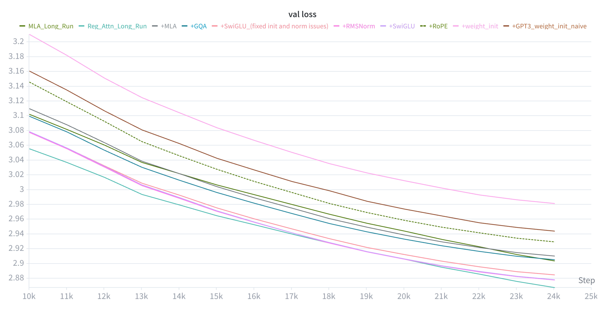

# GPT-Pro: DeepSeek-Style MoE LLM

A research-oriented LLM training framework built from scratch. Started as a GPT-2 implementation and evolved into a DeepSeek-V3-style architecture through iterative improvements informed by recent papers. Features Grouped Query Attention (GQA), auxiliary-loss-free Mixture of Experts (MoE) with expert parallelism, FP8 training, and the Muon optimizer.



Built for large-scale distributed training on multi-GPU clusters (NVIDIA B200 / Blackwell).

## Highlights
- **Grouped Query Attention (GQA)** with RoPE and per-head RMSNorm.
- **Auxiliary-loss-free MoE** with shared + routed experts and bias-corrected routing.
- **Expert parallelism** via all-to-all dispatch/return across GPU ranks.
- **FP8 training** via NVIDIA Transformer Engine (TE) with BF16 parameters.
- **Muon + AdamW dual optimizer** -- Muon for weight matrices, AdamW for embeddings/norms.
- **Batch size warmup** -- gradient accumulation ramps from 1 to full over configurable steps.
- HellaSwag evaluation, distributed checkpointing, and W&B logging.

## Project Layout
```
pretrain.py                      # Main entry point (Hydra + FSDP setup)
src/models/gpt_te.py             # Model: GQA + MoE with Transformer Engine
src/training/trainer_te.py       # Training loop: FP8, FSDP, checkpointing
src/datasets/dataloader.py       # Shard-based distributed dataloader
src/utils/optimizers.py          # DualOptimizer (AdamW + Muon)
src/utils/helpers.py             # Param counting, FLOP estimation, RoPE
config/config_pretrain.yaml      # Default config (~5B params)
config/config_pretrain_big.yaml  # Large config (~9B params)
scripts/run_node.sh              # Single-node SLURM launcher (8 B200 GPUs)
scripts/run_multi_node.sh        # Multi-node SLURM launcher
scripts/data_prep/               # Dataset tokenization and preprocessing
```

## Architecture
The model is a decoder-only Transformer with:
- **GQA**: Separate Q/K/V projections with fewer KV heads than query heads. Per-head RMSNorm on Q and K after RoPE. Uses `scaled_dot_product_attention` with `enable_gqa=True`.
- **MoE block**: Shared dense experts (applied to all tokens) + routed experts with top-k sigmoid gating.
- **Aux-loss-free load balancing**: Gate bias adjusted based on global expert token counts -- no auxiliary loss term needed.
- **Expert parallelism**: Routed experts sharded across GPUs with all-to-all dispatch and return.

## Training Stack
- **Distributed**: PyTorch FSDP (`SHARD_GRAD_OP`) with MoE modules excluded (they handle their own expert-parallel distribution).
- **Mixed precision**: BF16 parameters, FP8 GEMMs via Transformer Engine autocast.
- **Optimizer**: `DualOptimizer` -- `torch.optim.Muon` for 2D weight matrices, `torch.optim.AdamW` for embeddings, norms, and biases.
- **LR schedule**: Linear warmup + cosine decay.
- **Logging**: W&B (rank 0), JSONL expert utilization logs.

## Scale
- Largest model trained: **~15B total params, ~4B active params**.
- Hardware: **NVIDIA B200 (Blackwell)** GPUs on HiPerGator.
- Parallelism: Data parallelism (FSDP) + expert parallelism + optimizer sharding.

The chart above shows iterative feature additions on a 350M-scale model; MoE and expert parallelism were then added at larger scale.

## Quickstart

### 1) Prepare data
```bash
# ClimbMix-400B (primary dataset)
bash scripts/data_prep/run_climbmix_tokenizer.sh

# Or FineWeb-EDU (alternative)
python scripts/data_prep/fineweb.py
```

### 2) Configure
Edit `config/config_pretrain.yaml` for model size, MoE settings, and training schedule. A larger config is available at `config/config_pretrain_big.yaml`.

### 3) Train
```bash
# Submit SLURM job (single node, 8 GPUs)
sbatch scripts/run_node.sh

# Or run directly on a GPU node
torchrun --nproc-per-node=8 pretrain.py

# Resume from checkpoint
torchrun --nproc-per-node=8 pretrain.py resume_checkpoint=output/checkpoints/LM_Neo_5B/best_val
```

### 4) Evaluate
```bash
torchrun --nproc-per-node=8 evaluate.py
```

### 5) Inference
```bash
torchrun --nproc-per-node=1 inference.py
```

## Outputs
- Checkpoints: `output/checkpoints/<run_name>/` (PyTorch DCP format)
- Expert load stats: `output/expert_stats/layer_loads.jsonl`
- Hydra logs: `output/hydra/<date>/<time>/`

## Citation / Credit
Inspired by GPT-2 and DeepSeek-V3 design choices, adapted for large-scale high-throughput training on Blackwell GPUs.
